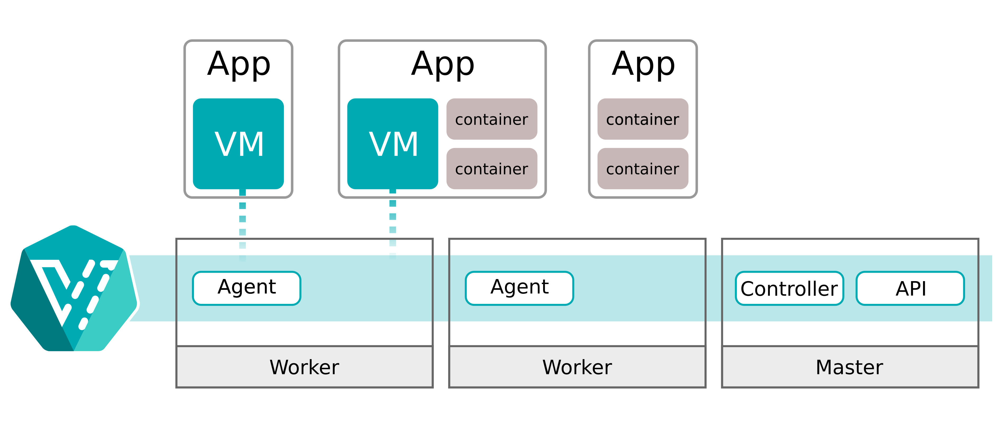
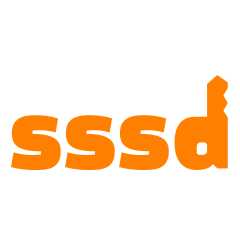
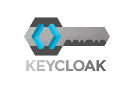

# Tecnologias avaliadas para implantação de infraestrutura

## Esta documentação tem por objetivo reunir informações das tecnologias cogitadas para a implantação de uma nova infraestrutura on-premise base.

&nbsp;

# 1.) [Harvester](https://harvesterhci.io/)

&nbsp;

## É uma ferramenta de infraestrutura hiperconvergida (HCI) que propicia *storage*, *computing*, e *networking* em um único sistema, que podem ser escalados rapidamente, virtualizando as redes e conectando os componentes de armazenamento aos demais recursos computacionais, podendo também prover máquinas virtuais containerizadas usando um kubernetes como plataforma.

&nbsp;

&nbsp;

# 1.1) Tecnologias envolvidas no Harvester:

&nbsp;

##  - [kubevirt](https://kubevirt.io/): solução que containzeriza VMs, permitindo melhor integração com o k8s

&nbsp;

##  - [longhorn](https://longhorn.io/): proporciona blocos de armazenamento distribuídos e altamente disponíveis para k8s

&nbsp;

##  - [rancher](https://www.rancher.com/): k8s-as-a-service, facilita o gerenciamento e a implantação de k8s

&nbsp;

##  - [rke](https://www.rancher.com/products/rke): distribuição kubernetes que roda inteiramente em containers [docker](https://www.docker.com/)

&nbsp;

# 2.) [System Security Services Daemon (SSSD)](https://sssd.io/)

&nbsp;

## São um conjunto de *daemons* de autenticação e autorização integrados. Eles têm por objetivo deixar a arquitetura mais independente, proporcionando *cache* para autenticação *offline*, e modificando a interface de contato com os servidores de autenticação, independente da solução implantada para controle.

&nbsp;

&nbsp;

&nbsp;

# 3.) [Keycloak](https://www.keycloak.org/)

&nbsp;

## Ferramenta OpenSource de controle de identidade e acesso. Nela, aplicações e pessoas possuem contas, que por sua vez possuem políticas de acesso.

&nbsp;

## 3.1) [Integração: Keycloak x FreeIPA x SSSD](https://github.com/keycloak/keycloak-documentation/blob/main/server_admin/topics/user-federation/sssd.adoc)

&nbsp;